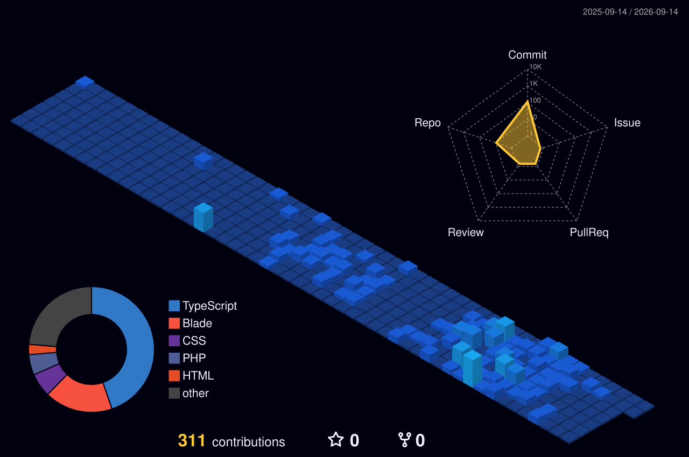

    

  

  Currently studying at the University of the Cordilleras, I am currently taking

 
  Bachelor of Science in Information Technology

 

<ul style="list-style-type: none; padding-left: 0; font-size: 1.1em; font-weight: bold; line-height: 1.8;">
  <li>🔭 I’m currently working on a project **UniSuki**</li>
  <li>🌱 I'm currently learning **Advanced Database Indexing Patterns, Caching Strategies, and SEO**</li>
  <li>💬 Ask me about **Tailwind CSS, React, and Expo Mobile Development**</li>
  <li>⚡ **Fun Fact:** My day depends entirely on how strong my coffee is.</li>
</ul>

### 

   
  🤝 <b>Let's Connect!</b>
    
  
  
  
  
  

  <table border="0" cellpadding="0" cellspacing="0" width="100%">
    <tr>
      <td width="50%" align="center" valign="top">
        <h3>🌐 Web Stack & Languages</h3>
        
        
        
        
        
        
        
          
        
         
        
        
        
      </td>
      <!-- Right Column: Backend, Database & Mobile -->
      <td width="50%" align="center" valign="top">
        <h3>⚙️ Backend, Database & Mobile</h3>
        
        
        
        
        
          
        
        
        
        
        
      </td>
    </tr>
  </table>
  <h3>🎨 Design & Machine Learning</h3>
  
  
  
   
  

